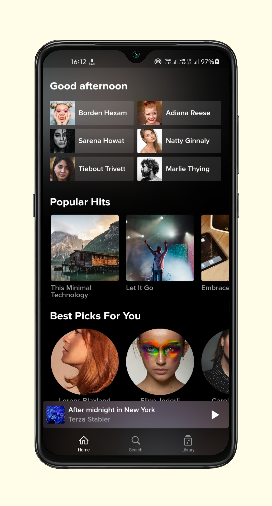
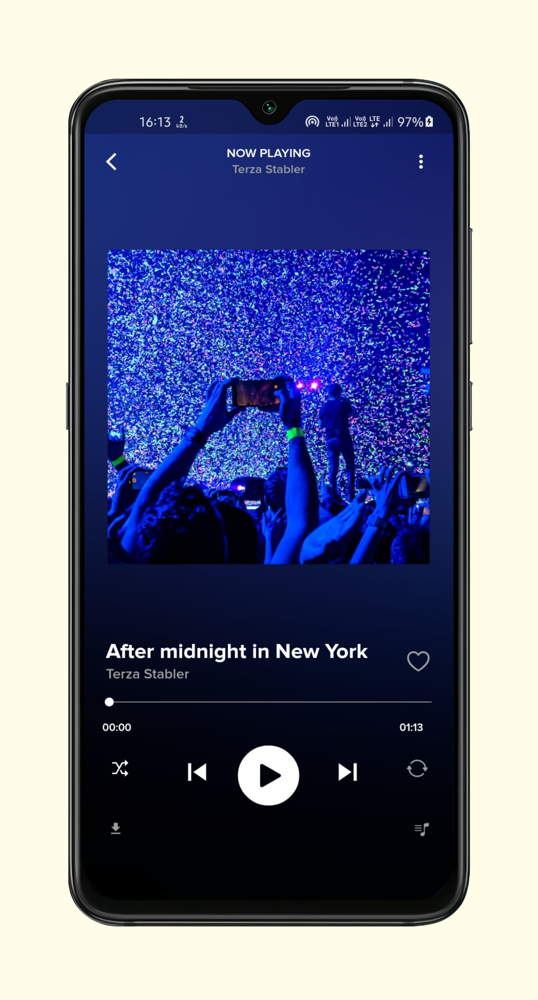
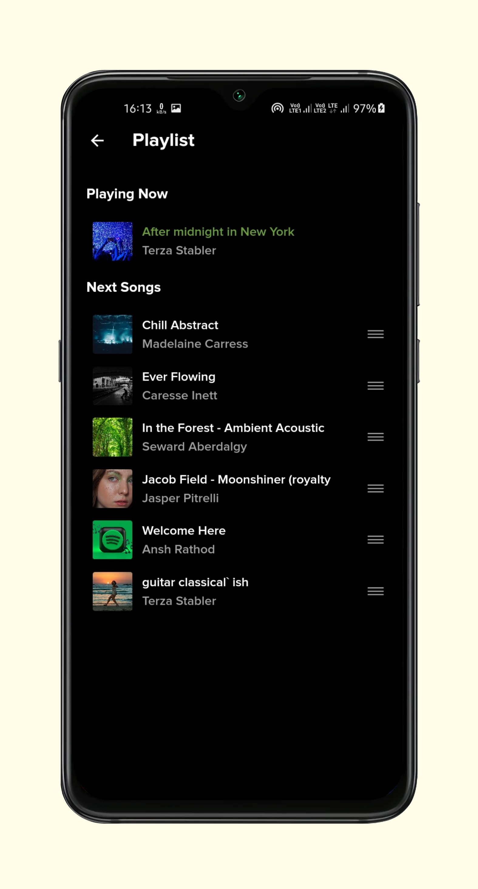
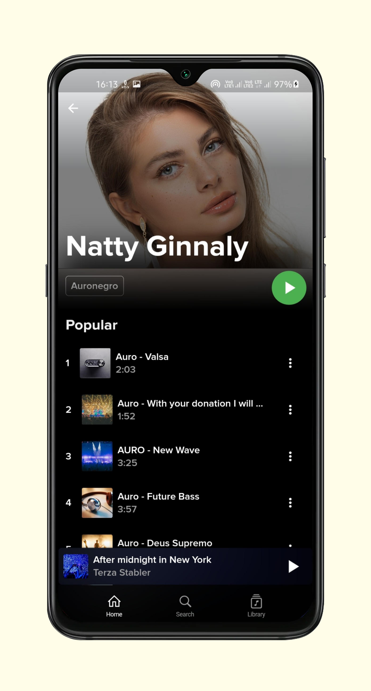
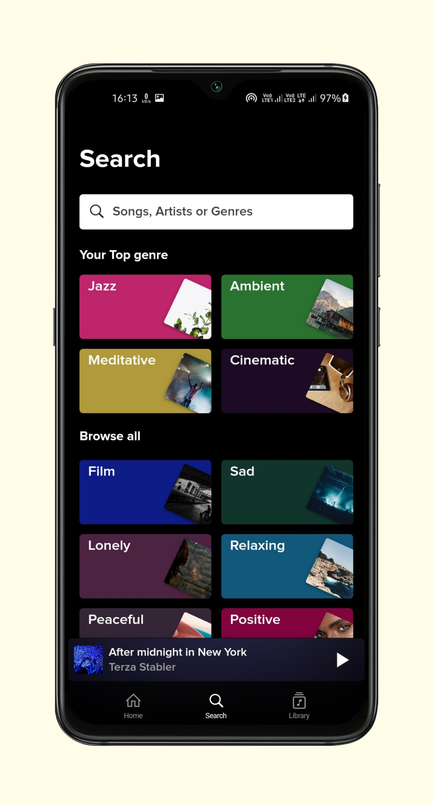
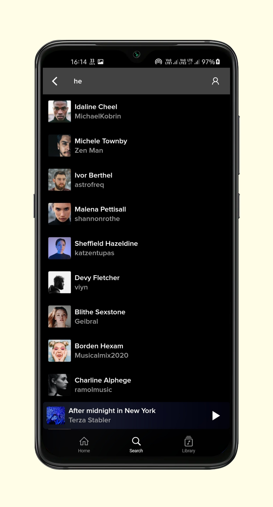
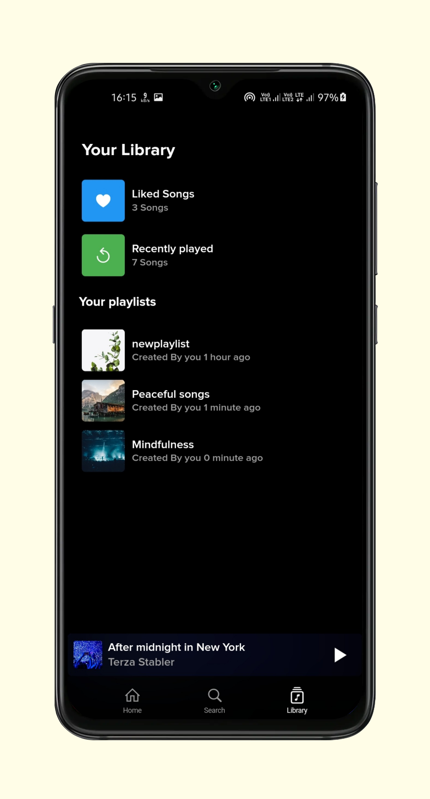
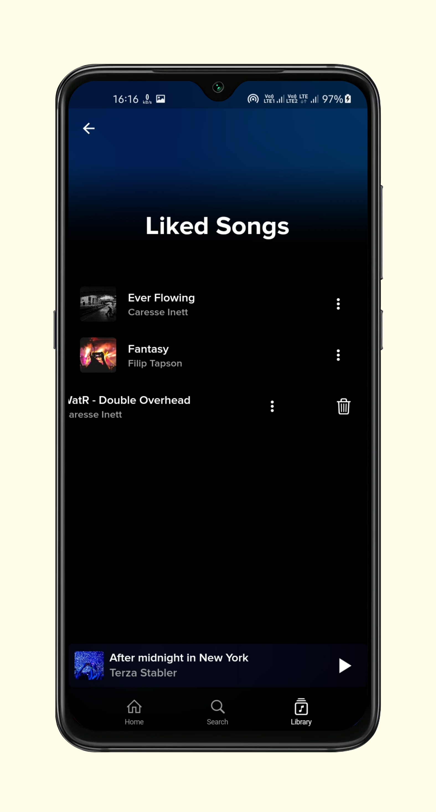
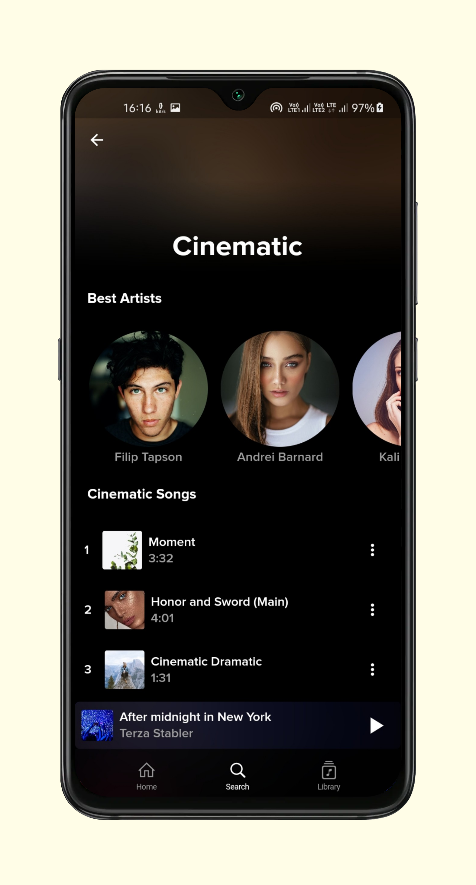

# Musive

Full-stack music player app is written in flutter and dart using node.js music API. Fully Functional music player with UI like Spotify app. Added 500+ royalty-free music and information about artists. Application users can make their own playlist or collect liked songs. 
for backend setup [here](https://github.com/Ansh-Rathod/Musive-Backend)

## **Demo**

<p align="center">


<h3 align="center"><a href="https://github.com/Ansh-Rathod/Flutter-Musive-app/releases/download/v1.0.0/app-armeabi-v7a-release.apk">Download the release APK</a></h3>
</p>

# Features

- added 1000+ music, 300+ artists
- Queue Management
- can make a collection of liked songs.
- create/delete your own playlist.
- Spotify UI clone for the best experience.
- notification player.
- recordable list for currently playing playlist ( you can drag music to set an order for playlist).
- Cache support
- Song, Album, Artist, and Playlist Search
- Best Streaming Quality

And much more
<br/>

## **Image Gallery**

<hr/>

<br>

<p align="center">










</p>
<hr/>

## **Dependencies**

- [cupertino_icons](https://pub.dev/packages/cupertino_icons)
- [http](https://pub.dev/packages/http)
- [flutter_bloc](https://pub.dev/packages/flutter_bloc)
- [assets_audio_player](https://pub.dev/packages/assets_audio_player)
- [hive_flutter](https://pub.dev/packages/hive_flutter)
- [cached_network_image](https://pub.dev/packages/cached_network_image)
- [url_launcher](https://pub.dev/packages/url_launcher)
- [line_icons](https://pub.dev/packages/line_icons)
- [provider](https://pub.dev/packages/provider)

## **How to run?**

To clone and run this application, you'll need [Git](https://git-scm.com/downloads) and [Flutter](https://flutter.dev/docs/get-started/install) installed on your computer. From your command line:

### first setup backned from here

[Backend setup](https://github.com/Ansh-Rathod/Musive-Backend)
you can setup backend on heroku. i have attached some steps for setup in readme file of backend.
and edit api/url.dart file put your own url in baseUrl variable without "https://"

### Clone this repository

```bash
$ git clone https://github.com/Ansh-Rathod/Flutter-Musive-app.git
```

### Go into the repository

```bash
$ cd Flutter-Musive-app
```

### Install dependencies

```bash
$ flutter pub get

```

### Run the app

```bash
$ flutter run
```

# Contact me

for backend or any other configuration feel free to contact me.

<a href="mailto: anshrathod29@gmail.com">

</a>
<a href="https://twitter.com/appiirathod">

</a>
<a href="https://www.linkedin.com/in/ansh-rathod-478a81210/">

</a>
